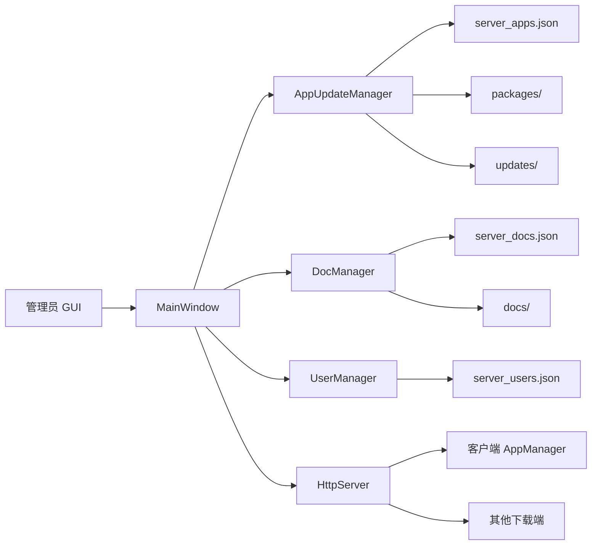

# UpdateServer

UpdateServer 是一个面向 Windows 桌面环境的轻量级应用分发与升级服务端，使用 Qt 5.15.2 + C++17 开发，集成了本地管理界面、嵌入式 HTTP 服务、应用升级元数据生成、文档分发、用户目录可见性控制、历史版本归档和日志管理能力。

它通常与上级目录中的 AppManager 客户端配套使用：服务端负责维护升级包和元数据，客户端通过 HTTP 拉取版本信息、下载安装包并执行升级。

项目版本：1.0.1.3

## 项目定位

这个项目不是传统意义上的 Web 后台，而是一个“桌面控制台 + 内嵌 HTTP Server”的发布中心，适合以下场景：

- 企业内网中的多应用统一升级分发
- 需要图形化维护升级包、文档和用户目录的场景
- 需要快速落地、零第三方依赖的轻量部署
- 与 AppManager 一类客户端组成完整的自更新系统

## 核心能力

### 1. 应用升级管理

- 维护多个应用的升级条目
- 支持 EXE 和 ZIP 两类升级包
- 选择升级包后自动复制到 packages/{appId}/ 目录
- 自动计算升级包 SHA256
- 为客户端生成静态升级元数据文件 updates/{appId}.json
- 支持安装子目录、多开标记、ZIP 递归替换 EXE 策略
- 支持依赖文件清单、完整包、依赖目录三种补齐信息
- 支持版本说明 changeLog
- 支持历史版本归档、手动添加历史版本、历史版本说明维护

### 2. 文档分发管理

- 维护文档条目及下载文件
- 支持 PDF、Word、Excel、PowerPoint、Markdown、TXT 等文件类型
- 支持分类、关键词、描述、版本号、排序权重
- 可按 requiresLogin 标记为“登录后才在目录中可见”
- 通过 HTTP 动态提供文档目录和下载地址

### 3. 用户管理与登录

- 提供管理员、普通用户两类角色
- 支持按用户限制可见应用列表 allowedApps
- 提供 POST /login 登录接口并返回 Bearer Token
- 令牌保存在内存中，服务重启后失效

### 4. 内嵌 HTTP 服务

- 提供升级元数据、升级包、历史版本、依赖文件、文档目录、文档下载、状态查询、登录等接口
- 基于 QTcpServer 异步处理请求
- 大文件按块异步发送，支持 HTTP Range 断点续传
- 默认启用 CORS 响应头，方便客户端或前端工具访问

### 5. 运行与维护能力

- GUI 模式和无头模式双启动方式
- 系统托盘运行与恢复界面
- 单实例运行，重复启动时会唤起已有实例
- server.log 文件日志与自动轮转
- 路径穿越防护、请求大小限制、连接数限制、空闲超时

## 系统架构



### 模块说明

| 模块 | 作用 |
| --- | --- |
| MainWindow | 主控制台，负责服务启停、应用管理、文档管理、用户管理、日志展示、无头模式切换 |
| HttpServer | 提供 HTTP 接口，请求分发、连接管理、异步文件发送、简单认证协作 |
| AppUpdateManager | 维护应用升级条目，计算 SHA256，保存配置，生成静态元数据，维护历史版本 |
| DocManager | 管理文档条目与文档目录，生成文档目录 JSON |
| UserManager | 管理用户、密码、角色和 allowedApps 列表，提供登录认证 |
| Logger | 单例日志组件，负责 server.log 追加写入和轮转 |

## 技术栈

| 项目项 | 说明 |
| --- | --- |
| 开发语言 | C++17 |
| UI / 基础框架 | Qt 5.15.2 |
| Qt 模块 | core、gui、widgets、network |
| 构建系统 | qmake |
| 编译器 | MinGW 8.1.0 32-bit |
| 目标平台 | Windows |
| 系统库 | version.dll |
| 第三方依赖 | 无 |

## 源码目录说明

```text
UpdateServer/
├─ main.cpp                    # 程序入口、命令行参数、单实例处理
├─ mainwindow.h/.cpp           # 主窗口与管理面板
├─ httpserver.h/.cpp           # 内嵌 HTTP 服务
├─ appupdatemanager.h/.cpp     # 应用升级条目管理
├─ appeditdialog.h/.cpp        # 应用编辑对话框
├─ docmanager.h/.cpp           # 文档条目管理
├─ docentry.h                  # 文档数据结构
├─ docwindow.h/.cpp            # 文档管理页
├─ doceditdialog.h/.cpp        # 文档编辑对话框
├─ usermanager.h/.cpp          # 用户管理与登录认证
├─ usereditdialog.h/.cpp       # 用户编辑对话框
├─ logger.h/.cpp               # 日志组件
├─ resources/                  # 图标等资源
├─ 示例文件/server_apps.json    # 应用配置示例
├─ 技术栈说明文档.md            # 技术栈说明
└─ 服务端自更新适配指南.md      # 与 AppManager 对接说明
```

## 运行目录结构

程序运行时默认以可执行文件所在目录作为工作根目录，并自动使用或创建以下目录/文件：

```text
UpdateServer.exe
├─ packages/                  # 升级包根目录，应用包实际存放在 packages/{appId}/
├─ packages/history/{appId}/  # 历史版本归档目录
├─ updates/                   # 自动生成的静态升级元数据文件
├─ docs/                      # 文档文件根目录，实际存放在 docs/{docId}/
├─ server_apps.json           # 应用配置
├─ server_docs.json           # 文档配置
├─ server_users.json          # 用户配置
└─ server.log                 # 日志文件
```

### 启动时的默认行为

- 自动创建 packages/、updates/、docs/ 目录
- 如果 server_apps.json 不存在，则按空配置启动
- 如果 server_docs.json 不存在，则按空配置启动
- 如果 server_users.json 不存在，则自动创建默认管理员账户

默认管理员账户：

- 用户名：admin
- 密码：admin123
- 角色：admin

建议在首次部署后立即修改默认密码。

## 构建要求

### 环境要求

- Windows
- Qt 5.15.2
- qmake
- MinGW 8.1.0 32-bit
- 上级目录存在 AppManager 工程，用于提供共享文件 versionutils.cpp 和 versionutils.h

当前工程文件 UpdateServer.pro 直接引用：

- ../AppManager/versionutils.cpp
- ../AppManager/versionutils.h

因此推荐目录结构如下：

```text
QtProjects/
├─ AppManager/
└─ UpdateServer/
```

如果只单独拷贝了 UpdateServer 仓库，需要自行补齐这两个共享文件或调整工程文件引用路径。

## 构建方法

在项目根目录执行：

```bash
qmake UpdateServer.pro
mingw32-make
```

默认输出目录由 qmake 配置为：

```text
UpdateServer/UpdateServer.exe
```

如果是独立部署，别忘了同时准备 Qt 运行时库。常见做法是在构建产物目录执行 Qt 自带部署工具，例如：

```bash
windeployqt UpdateServer/UpdateServer.exe
```

## 启动方式

### GUI 模式

```bash
UpdateServer.exe
```

### 无头模式

```bash
UpdateServer.exe --headless --port 8080
```

也支持短参数：

```bash
UpdateServer.exe -H -p 8080
```

### 启动参数

| 参数 | 说明 |
| --- | --- |
| --headless, -H | 启动后不主动展示主窗口，直接以托盘/无头方式运行 |
| --port, -p | 指定监听端口，默认 8080 |

## 管理界面说明

### 1. 服务器控制区

- 设置监听端口，范围 1024 到 65535
- 启动或停止 HTTP 服务
- 切换到无头模式
- 结束进程并立即退出
- 显示当前运行状态和基础访问地址

### 2. 应用管理页

表格默认展示以下字段：

- 应用 ID
- 名称
- 最新版本
- 包文件
- 包类型
- 安装子目录
- 允许多开
- ZIP 递归替换 EXE
- SHA256 前缀

可执行操作：

- 新增应用
- 编辑应用
- 删除应用
- 历史版本管理
- 刷新列表

### 3. 文档管理页

表格默认展示：

- 文档 ID
- 标题
- 版本
- 分类
- 文件名
- 排序权重
- SHA256 前缀

可执行操作：

- 新增文档
- 编辑文档
- 删除文档记录
- 刷新

说明：删除文档只删除配置记录，不会删除磁盘上的文档文件。

### 4. 用户管理页

表格默认展示：

- 用户名
- 角色
- 允许应用列表

可执行操作：

- 新增用户
- 编辑用户
- 删除用户
- 刷新

## 应用升级条目字段说明

server_apps.json 顶层是一个对象，常见结构如下：

```json
{
  "packagesDir": "D:/UpdateServer/packages",
  "apps": [
    {
      "appId": "AppManager",
      "appName": "AppManager",
      "latestVersion": "1.0.0",
      "packageFileName": "AppManagerSetup_1.0.0.exe",
      "sha256": "",
      "packageType": "exe",
      "subDir": "",
      "allowMultiInstance": false,
      "zipReplaceExeRecursively": false,
      "requiresLogin": false,
      "requiredFiles": [],
      "fullPackageFileName": "",
      "depsDir": "",
      "changeLog": "",
      "history": []
    }
  ]
}
```

字段说明：

| 字段 | 说明 |
| --- | --- |
| packagesDir | 升级包根目录，可省略；省略时默认使用 exe 同级 packages/ |
| appId | 应用唯一标识，客户端据此请求 updates/{appId}.json |
| appName | 应用显示名称 |
| latestVersion | 当前最新版本号 |
| packageFileName | 当前最新升级包文件名，实际位于 packages/{appId}/ |
| sha256 | 当前升级包的 SHA256，保存时自动计算 |
| packageType | exe 或 zip |
| subDir | 客户端安装子目录 |
| allowMultiInstance | 是否允许客户端展示为可多开应用 |
| zipReplaceExeRecursively | ZIP 升级时是否递归替换目录中的 EXE |
| requiresLogin | 是否需要登录后才在 /catalog 中可见 |
| requiredFiles | 客户端升级前需要检查的依赖文件列表 |
| fullPackageFileName | 依赖严重缺失时供客户端下载的完整包文件名 |
| depsDir | 依赖文件目录的绝对路径，供 /dep/{appId} 单文件下载 |
| changeLog | 当前版本更新说明 |
| history | 历史版本列表，元素包含 version、fileName、sha256、changeLog |

### 应用编辑对话框支持的能力

- 选择升级包后自动复制到 packages/{appId}/
- 对 EXE 包自动读取文件版本资源；读不到时尝试从文件名解析版本号
- 自动识别 packageType 为 exe 或 zip
- 自动计算 SHA256
- 允许配置完整包和依赖目录
- 支持填写多行 requiredFiles 和多行 changeLog

## 文档配置字段说明

server_docs.json 顶层是一个对象，常见结构如下：

```json
{
  "docsDir": "D:/UpdateServer/docs",
  "docs": [
    {
      "docId": "install_guide",
      "title": "安装说明",
      "version": "1.0",
      "categories": ["安装", "指南"],
      "description": "客户端安装与初始配置说明",
      "fileName": "安装说明.pdf",
      "sha256": "",
      "keywords": ["安装", "部署", "首次启动"],
      "sortOrder": 100,
      "requiresLogin": false
    }
  ]
}
```

字段说明：

| 字段 | 说明 |
| --- | --- |
| docsDir | 文档根目录，可省略；省略时默认使用 exe 同级 docs/ |
| docId | 文档唯一标识 |
| title | 文档标题 |
| version | 文档版本 |
| categories | 分类列表，供客户端分组或筛选 |
| description | 文档描述 |
| fileName | 文档文件名，实际位于 docs/{docId}/ |
| sha256 | 文档文件 SHA256，保存时自动计算 |
| keywords | 关键词列表 |
| sortOrder | 排序权重，值越大越靠前 |
| requiresLogin | 是否需要登录后才在 /docs/catalog 中可见 |

## 用户配置字段说明

server_users.json 顶层直接是数组，结构如下：

```json
[
  {
    "id": "b0d2cc8d-a4f5-4ac1-8d62-57c2c6a1a001",
    "username": "admin",
    "password": "admin123",
    "role": "admin",
    "allowedApps": []
  },
  {
    "id": "d8df90ce-6ea8-49c7-a2a1-cdd8659cfa6f",
    "username": "operator",
    "password": "123456",
    "role": "regular",
    "allowedApps": ["AppManager", "cantest"]
  }
]
```

字段说明：

| 字段 | 说明 |
| --- | --- |
| id | 用户唯一 ID，通常为 UUID |
| username | 登录用户名，必须唯一 |
| password | 当前实现为明文密码 |
| role | admin 或 regular |
| allowedApps | 允许在 /catalog 中看到的应用 ID 列表；为空表示允许全部 |

## HTTP 接口说明

### 接口总览

| 方法 | 路径 | 说明 | 是否需要登录 |
| --- | --- | --- | --- |
| GET | / | 健康检查 | 否 |
| GET | /status | 服务器状态与统计信息 | 否 |
| POST | /login | 用户登录并获取 token | 否 |
| GET | /updates/{appId}.json | 获取某个应用的静态升级元数据 | 否 |
| GET | /download/{appId}/{fileName} | 下载当前升级包 | 否 |
| GET | /dep/{appId}?file={relativePath} | 下载依赖目录中的单个文件 | 否 |
| GET | /catalog | 获取应用目录，按 token 过滤可见项 | 可选 |
| GET | /history/{appId} | 获取某应用历史版本列表 | 否 |
| GET | /download/history/{appId}/{fileName} | 下载历史版本包 | 否 |
| GET | /docs/catalog | 获取文档目录，按 token 过滤可见项 | 可选 |
| GET | /docs/download/{docId}/{fileName} | 下载文档文件 | 否 |

### 1. 登录接口

请求：

```http
POST /login
Content-Type: application/json

{"username":"admin","password":"admin123"}
```

成功响应：

```json
{
  "token": "0b3fd3f7d59f4231a8d498f6cb79be64",
  "username": "admin",
  "role": "admin"
}
```

说明：

- token 保存在服务进程内存中
- 服务重启后 token 全部失效
- 当前没有单独的 logout 接口

### 2. 静态升级元数据

GET /updates/{appId}.json 返回示例：

```json
{
  "latestVersion": "1.0.0",
  "downloadUrl": "http://192.168.1.100:8080/download/AppManager/AppManagerSetup_1.0.0.exe",
  "sha256": "abcdef1234567890",
  "packageType": "exe",
  "subDir": "",
  "allowMultiInstance": false,
  "zipReplaceExeRecursively": false,
  "changeLog": "修复若干已知问题",
  "requiredFiles": [],
  "fullPackageUrl": "http://192.168.1.100:8080/download/AppManager/AppManagerFull_1.0.0.zip",
  "depsBaseUrl": "http://192.168.1.100:8080/dep/AppManager"
}
```

### 3. 应用目录接口

GET /catalog 返回的是动态目录，而不是静态文件。返回项除了下载地址外，还包含 updateMetaUrl。

示例：

```json
[
  {
    "appId": "AppManager",
    "appName": "AppManager",
    "latestVersion": "1.0.0",
    "packageType": "exe",
    "packageFileName": "AppManagerSetup_1.0.0.exe",
    "allowMultiInstance": false,
    "downloadUrl": "http://192.168.1.100:8080/download/AppManager/AppManagerSetup_1.0.0.exe",
    "updateMetaUrl": "http://192.168.1.100:8080/updates/AppManager.json",
    "changeLog": "修复若干已知问题"
  }
]
```

### 4. 历史版本接口

GET /history/{appId} 示例：

```json
{
  "appId": "AppManager",
  "appName": "AppManager",
  "currentVersion": "1.0.0",
  "versions": [
    {
      "version": "0.9.0",
      "fileName": "AppManagerSetup_0.9.0.exe",
      "sha256": "abcdef123456",
      "changeLog": "上一版本说明",
      "downloadUrl": "http://192.168.1.100:8080/download/history/AppManager/AppManagerSetup_0.9.0.exe"
    }
  ]
}
```

### 5. 文档目录接口

GET /docs/catalog 返回示例：

```json
[
  {
    "docId": "install_guide",
    "title": "安装说明",
    "version": "1.0",
    "categories": ["安装", "指南"],
    "description": "客户端安装与初始配置说明",
    "fileName": "安装说明.pdf",
    "sha256": "abcdef123456",
    "keywords": ["安装", "部署"],
    "sortOrder": 100,
    "downloadUrl": "http://192.168.1.100:8080/docs/download/install_guide/安装说明.pdf"
  }
]
```

### 6. 状态接口

GET /status 返回示例：

```json
{
  "status": "ok",
  "server": "UpdateServer",
  "uptimeSeconds": 3600,
  "activeConnections": 2,
  "maxConnections": 200,
  "totalRequests": 150,
  "connectionTimeoutMs": 30000,
  "appCount": 5
}
```

### 7. Range 断点续传

以下文件下载接口支持 HTTP Range：

- /updates/{appId}.json
- /download/{appId}/{fileName}
- /dep/{appId}?file=...
- /download/history/{appId}/{fileName}
- /docs/download/{docId}/{fileName}

当客户端带上 Range 请求头时，服务端会返回 206 Partial Content。

## 典型使用流程

### 场景一：发布一个新应用版本

1. 打开 UpdateServer 管理面板
2. 在“应用管理”中点击“新增应用”或“编辑”
3. 选择升级包文件，程序会自动复制到 packages/{appId}/
4. 自动计算 SHA256，并尝试读取 EXE 版本号
5. 可选填写 requiredFiles、fullPackageFileName、depsDir、changeLog
6. 保存条目
7. 启动 HTTP 服务
8. 服务启动后自动生成 updates/{appId}.json
9. 客户端通过 /updates/{appId}.json 和 /download/... 完成升级

### 场景二：管理历史版本

1. 在应用管理页选中应用
2. 点击“历史版本”
3. 可归档当前版本、手动添加历史版本、删除历史版本记录、编辑历史版本说明
4. 历史包文件保存到 packages/history/{appId}/

### 场景三：维护文档中心

1. 进入“文档管理”页
2. 新增或编辑文档
3. 选择要分发的文档文件
4. 填写分类、关键词、描述、排序权重
5. 客户端通过 /docs/catalog 和 /docs/download/... 获取内容

### 场景四：按用户限制目录可见性

1. 在“用户管理”中创建用户
2. 为普通用户配置 allowedApps
3. 将应用或文档标记为 requiresLogin
4. 客户端先调用 /login 获取 Bearer Token
5. 再请求 /catalog 或 /docs/catalog 获得过滤后的目录结果

## 快速验证

假设服务运行在本机 8080 端口，可使用以下命令验证：

```bash
curl http://127.0.0.1:8080/
curl http://127.0.0.1:8080/status
curl http://127.0.0.1:8080/catalog
curl http://127.0.0.1:8080/updates/AppManager.json
```

登录验证：

```bash
curl -X POST http://127.0.0.1:8080/login \
  -H "Content-Type: application/json" \
  -d "{\"username\":\"admin\",\"password\":\"admin123\"}"
```

带 token 获取目录：

```bash
curl http://127.0.0.1:8080/catalog \
  -H "Authorization: Bearer <token>"
```

## 日志与运行特性

### 日志

- 日志文件为 server.log
- 单个日志文件默认最大 10 MB
- 超过后自动轮转为 .1 到 .5
- UI 日志区最多保留 500 条可视日志

### 单实例

- 使用本地命名连接 UpdateServerInstance 做单实例检查
- 如果发现已有实例，新进程会通知已有实例显示界面并退出

### 无头模式

- 以无头模式启动后，服务会直接监听指定端口
- 应用驻留系统托盘
- 双击托盘图标可恢复窗口

### 网络保护

- 默认最大活动连接数 200
- 连接达到 80% 阈值会触发告警日志
- 空闲超时时间 30000 ms
- 单个请求最大大小 16 KB
- 路径穿越请求会被拒绝

## 重要注意事项

### 1. requiresLogin 目前只影响“目录可见性”

当前实现中：

- /catalog 会根据登录状态和 allowedApps 过滤应用列表
- /docs/catalog 会根据登录状态过滤文档列表

但以下直链下载接口本身不做 token 校验：

- /updates/{appId}.json
- /download/{appId}/{fileName}
- /download/history/{appId}/{fileName}
- /docs/download/{docId}/{fileName}
- /dep/{appId}?file=...

这意味着 requiresLogin 更接近“客户端目录展示控制”，而不是完整的下载鉴权。

### 2. 用户密码当前是明文存储

server_users.json 中的 password 当前按明文保存和比对，不是哈希值。若用于正式环境，建议优先改造成哈希存储。

### 3. publicBaseUrl 字段当前未接入主流程

配置模型中虽然预留了 publicBaseUrl 字段，但当前主窗口启动服务和生成静态元数据时并没有把它接入实际生成逻辑。

目前的行为是：

- 静态元数据 updates/{appId}.json 使用自动探测到的本机 IPv4 地址和监听端口生成下载地址
- 动态目录接口也默认基于当前服务监听地址返回 URL

如果你部署在反向代理、Nginx、域名或 CDN 后面，建议先验证客户端下载地址是否符合预期。

### 4. 静态元数据在服务启动后生成

updates/{appId}.json 的重新生成依赖服务已启动，因为生成时需要确定 baseUrl。仅编辑应用但未启动服务时，不会输出新的静态元数据文件。

### 5. 默认管理员口令应立即修改

首次启动若未提供 server_users.json，会自动创建 admin/admin123。请在部署后立即修改。

## 已知实现边界

- ZIP 升级包在服务端数据模型和分发协议中受支持，但界面对 EXE 版本号的自动识别最完善
- 用户 token 保存在内存中，服务重启后全部失效
- 当前没有专门的退出登录接口
- 删除应用或文档记录默认不会删除对应磁盘文件

## 与 AppManager 的协作关系

典型协作方式如下：

1. UpdateServer 维护 packages/、docs/、users 和 updates/
2. AppManager 请求 /updates/{appId}.json 获取最新版本信息
3. AppManager 请求 /download/... 下载升级包
4. 如客户端发现依赖缺失，可使用 fullPackageUrl 或 depsBaseUrl 继续补齐
5. 如客户端需要应用目录或文档目录，可调用 /catalog 与 /docs/catalog

如果你正在为 AppManager 自更新接入本服务，建议先阅读：

- [服务端自更新适配指南](服务端自更新适配指南.md)
- [技术栈说明文档](技术栈说明文档.md)
- [示例文件/server_apps.json](示例文件/server_apps.json)

## 适合继续扩展的方向

- 为下载接口补充真正的鉴权与授权
- 将用户密码改造为带盐哈希存储
- 将 publicBaseUrl 纳入界面配置与元数据生成流程
- 补充 logout、token 过期、刷新机制
- 增加 HTTPS、反向代理和部署文档
